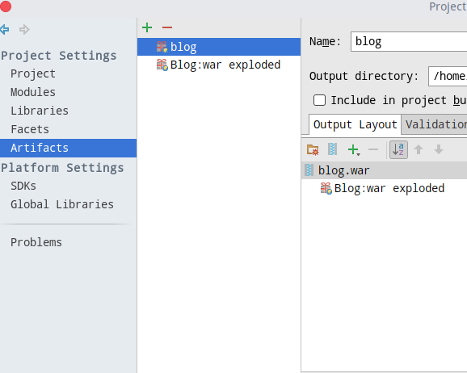

## 1. 服务器安装 Tomcat

在 https://tomcat.apache.org/ 下载与本地 Tomcat 版本相同的二进制包：

```bash
wget  http://mirror.cogentco.com/pub/apache/tomcat/tomcat-8/v8.0.47/bin/apache-tomcat-8.0.47.tar.gz
```

解压，移动到 /usr/local/tomcat：

```bash
tar xzvf apache-tomcat-8.0.47.tar.gz
mv apache-tomcat-8.0.47/ /usr/local/tomcat
```

启动：

```
cd /usr/local/tomcat/bin
./startup.sh
```

访问 http://服务器IP:8080/ 看是否出现 Tomcat 欢迎页

## 2. Intellij IDEA 打包项目文件为 war

ctrl+shift+alt+s 打开 `project structure`，点击 `Artifacts`，点击中间一栏上边的加号按钮添加 `Web Application: Archive`。默认的是 `Web Application: Exploded`，在 Build 的时候不会对项目进行打包，我们要新建一个 Archive 类型的，再进行 build 就会在指定目录生成 war 文件了。

在右侧指定名字和输出目录。

点 `Output layout` 选项下的加号按钮，添加 Artifact，选择项目默认的 Exploded Artifact 即可。本项目中默认的 Artifact 是 `Blog:war exploded`，我新增的 Artifact 是 `blog`，见下图：



设置完成后点 Build->Build Artifact，然后选择我们刚才新增的 Artifact 进行 Build 即可。完成后会在输出目录生成一个 blog.war 文件，将这个文件上传到服务器。

## 3. Tomcat 启动项目

将上一步上传的 war 文件移动到 Tomcat 的 webapps 目录下。我们把 Tomcat 放在了 /usr/local/tomcat，webapps 目录就在 /usr/local/tomcat/webapps。可以看到里面已经有一些文件了，这就是 Tomcat 欢迎页面，删除即可。

删除前观察文件的时候发现，在 webapps 目录下没有 `index.*` 之类的文件，但是访问 http://localhost:8080 依然可以看到欢迎页面。查看 webapps/ROOT 目录下的 index.jsp，果然 ROOT 目录直接作为网站的根目录。也就是说，我们的应用不需要移动文件，只需要把目录名改为 ROOT 即可。

将 war 文件移动到 webapps 目录下并不一定直接解压成应用目录，可能还需要访问一下 http://localhost:8080。

本应用解压后的目录树：

```
webapps
  blog.war
  blog/
    index.jsp
    ...
```

将 blog 文件夹改名为 ROOT，并删除 blog.war，访问 http://localhost:8080 即可看到博客页面。

## 4. Tomcat 多域名情况

如果单个域名不需要考虑这些情况，跳过这一点。

考虑到多个子域名的情况，我的 Tomcat 使用了多域名配置：

```jsp
<Engine name="Catalina" defaultHost="localhost">
<!-- <Host name="localhost"  appBase="webapps" unpackWARs="true" autoDeploy="true"> -->
<Host name="java.dx.style" appBase="webapps/java_app" unpackWARs="true" autoDeploy="true">
</Engine>
```

将原有配置注释掉，添加注释下面一行。其中 `name` 是域名，`appBase` 是域名对应目录，根目录是 tomcat 安装目录，即 /usr/local/tomcat。

这样后续如果我们需要 tomcat 代理多个域名，按照注释下面一行的格式添加即可。

## 5. nginx 配置

nginx 配置反向代理 http://java.dx.style 到 http://localhost:8080，即本地 tomcat 监听的端口：

```
location / {
    proxy_pass		http://127.0.0.1:8080/;
    proxy_redirect  off;
    proxy_set_header    Host                $host;
    proxy_set_header    X-Real-IP           $remote_addr;
    proxy_set_header    X-Forwarded-For     $proxy_add_x_forwarded_for;
    proxy_set_header    X-Forwarded-Proto   $scheme;
}
```

在虚拟域名配置文件中添加以上配置即可。

## 访问

所有配置完成无误后打开浏览器，访问 http://java.dx.style 即可看到我们未完成的博客了！

## 静态资源的问题

直接反向代理因为 nginx 配置文件的关系，可能会出现静态文件例如头像不加载、布局混乱的情况，注释掉 nginx 默认对静态文件的配置即可：

```
#location ~ .*\.(gif|jpg|jpeg|png|bmp|swf)$
#{
#    expires      30d;
#}

#location ~ .*\.(js|css)?$
#{
#    expires      12h;
#}
```
