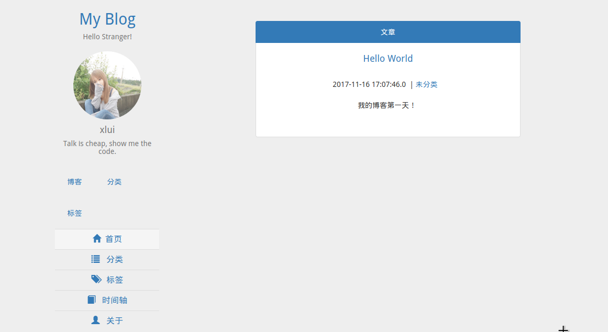

# Servlet-Jsp-Blog

一个基于 Servlet + JSP 的博客项目，基于 Intellij IDEA 构建，没有使用框架，现在开始开发了。

使用 
使用 [editor.md](https://github.com/pandao/editor.md) 做 Markdown 解析。

## 目前进度

成功部署到服务器：http://java.dx.style

首页预览：

