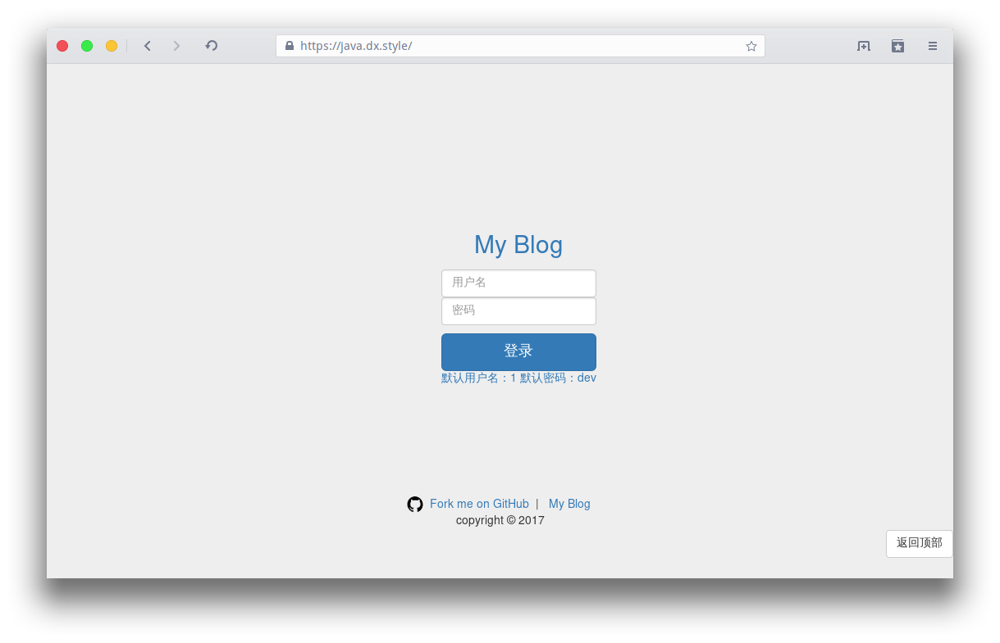
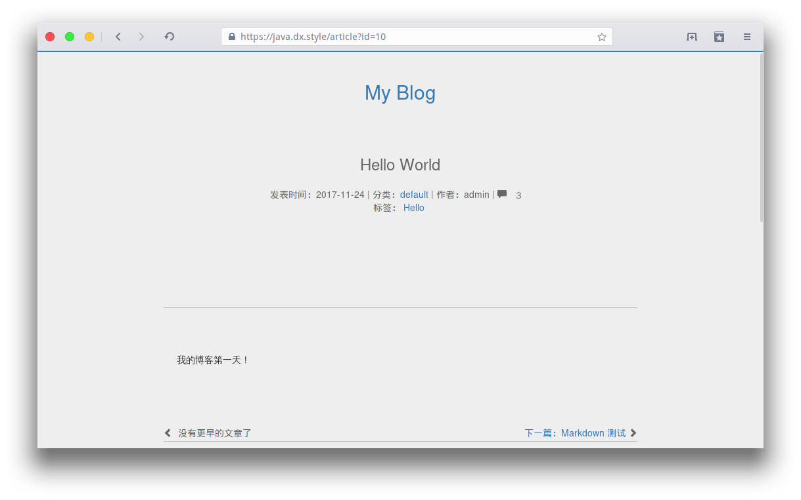
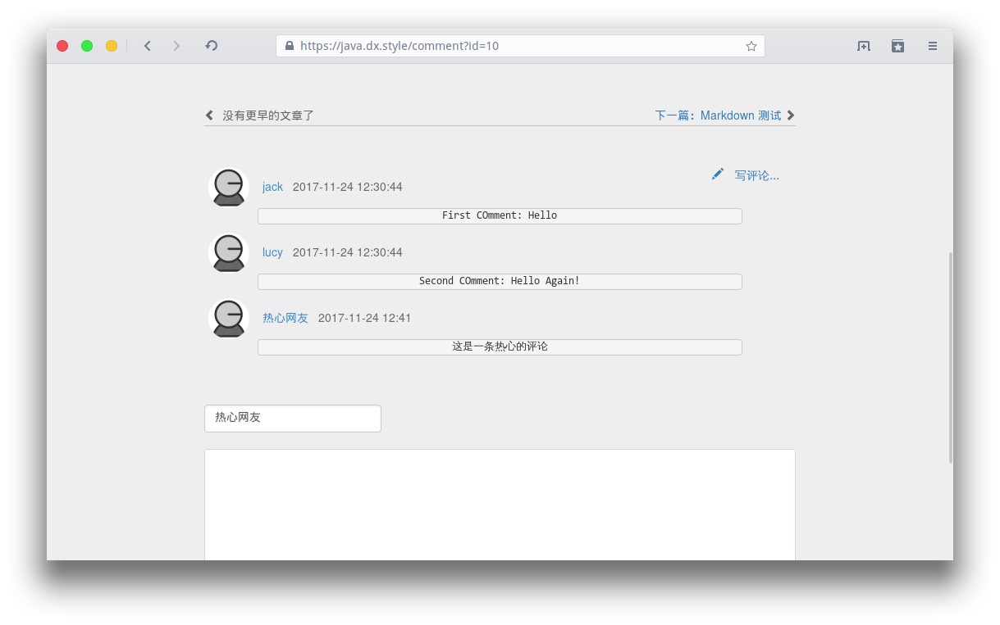
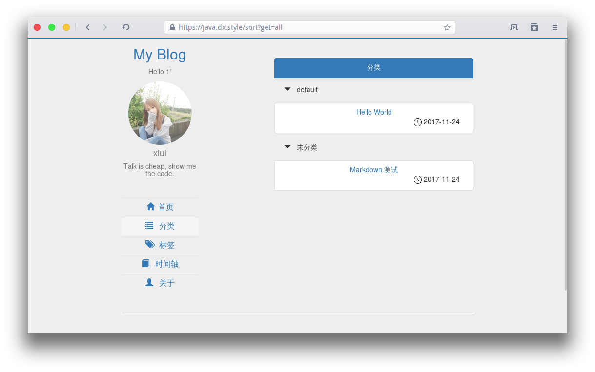
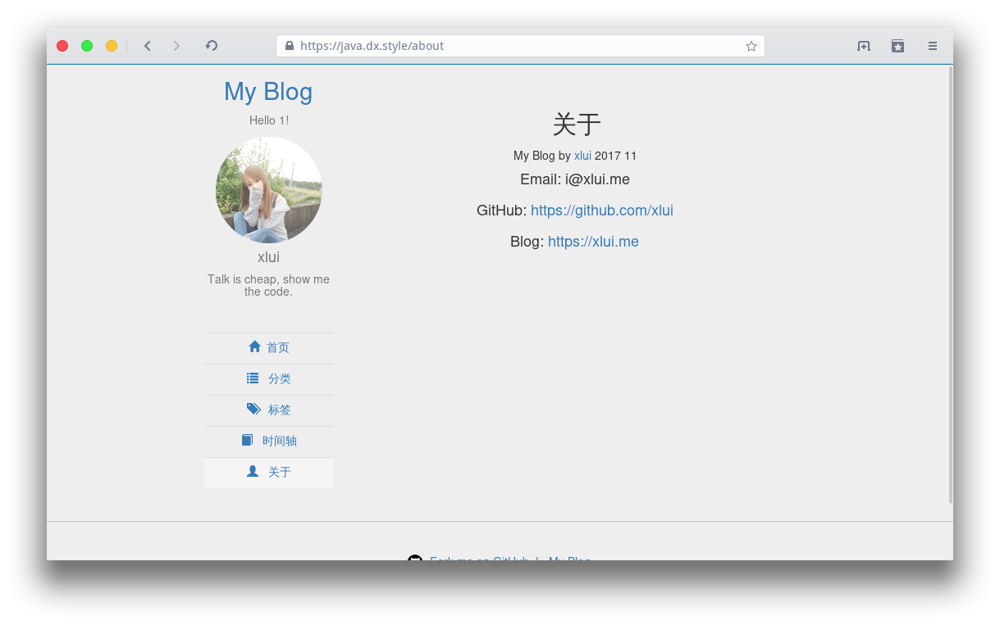

# Servlet-Jsp-Blog

一个基于 Servlet + JSP 的博客项目，基于 Intellij IDEA 构建，没有使用框架，现在开始开发了。

使用 [editor.md](https://github.com/pandao/editor.md) 做 Markdown 解析。

## 目前进度

已完成：

- 登录页
- 首页
- 文章页
- 评论页
- 分类页
- 关于页

登录页：

首页预览：

文章页：

评论页：

分类页：

标签页：

关于：

