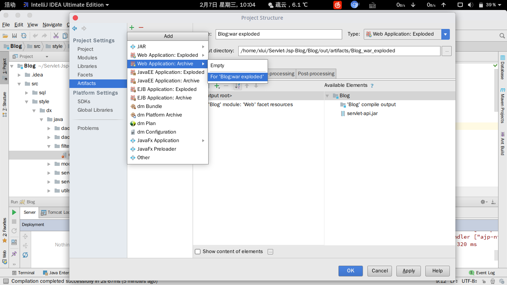

# 部署

## 本地运行

### 1. 设置项目环境

在 `Project Structure` 中设置：

1. Project SDK 为 Java 1.8
1. Project Language Level 为 8
1. Project Compile out 为 `Blog/out`

同时，在 Intellij IDEA 中将 src 目录标记为 Source Root，将 web 目录标记为 Resource Root。否则，可能运行后出现 404.

### 2. 设置 Artifacts

在 `Project Structure` -> `Project Settings` -> `Artifacts` 中添加两个 Artifacts：




### 3. 下载必要 JAR

本项目需要两个 Jar：jstl 和 mariadb，可以分别在 <https://mvnrepository.com/artifact/javax.servlet/jstl/1.2> 和 <https://downloads.mariadb.com/Connectors/java/> 下载。

下载完成后在 Intellij IDEA 的 Project Structure -> Project Settings -> Modules -> Dependencies 中添加。

同时需要添加 Servlet 的 API：


### 4. 创建并初始化数据库

创建数据库：

```mysql
create database java_blog;
grant all privileges on java_blog.* to admin@localhost identified by 'admin';
flush privileges;
```

初始化数据库：

```bash
mysql -u root -p < create_and_init.sql
```

在项目 `Blog/src/sql` 文件夹下。

### 5. 配置服务器

<kbd>shift</kbd>+<kbd>alt</kbd>+<kbd>f10</kbd> 打开配置设置。

添加本地 Tomcat 服务器。

在 Deployment 下添加名为 `Blog:war exploded` 的 Artifact。

## 部署到服务器

首先 clone 项目：

```bash
git clone https://github.com/xlui/Servlet-Jsp-Blog
```

使用 `Intellij IDEA` 打开项目，进入 `Project Structure` 页。

在 `Project Settings` -> `Project` 中，设置 `Project SDK` 和 `Project Language Level`：


在 `Project Settings` -> `Modules` 中添加 Servlet 的 api：


在 `Project Settings` -> `Artifacts` 中添加 Artifact：


点击 `Run` -> `Edit Configurations`，设置本地 Tomcat：


并设置 `Deployment`：

